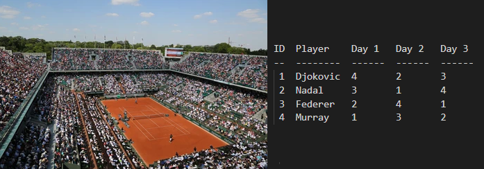

# Tournament Grid Generator




## Description

This project implements a small generator of tournament grid and displays it in the terminal console.

The type of tournament supported by the program is a **tournament where each participant meets each other participant only once**.


## How to compile the project

To compile the project, please run

```
$ make
```

## Usage

First of all, it is necessary to create your file of players. For this,
write the name of each player in a text file like `tests/examples/tennis.in`. Moreover, the number of players must be between 2 and 20.

```
Djokovic
Nadal
Federer
Murray
```

Then run the `tournament` binary by giving the player file to stdin to generate the tournament grid

```
$ ./tournament < your-player-file.in 
```


Multiple options are supported to generate the grid:

* Format (add `-f` or `--format`)
    * id
    * name

* Style (add `-s` or `--style`)
    * compact
    * table

By default, the tournament grid is generated with the `compact` style and the `id` format.


*First Example*

```
$ ./tournament -f id --style table < tests/examples/tennis.in 
ID  Player    Day 1   Day 2   Day 3 
--  --------  ------  ------  ------
 1  Djokovic  4       2       3     
 2  Nadal     3       1       4     
 3  Federer   2       4       1     
 4  Murray    1       3       2 
```

*Second example*

```
$ head -n 5 tests/examples/soccer-long.in | ./tournament -s table -f name
ID  Player    Day 1     Day 2     Day 3     Day 4     Day 5   
--  --------  --------  --------  --------  --------  --------
 1  Allemagn  Bye       Angleter  Bulgarie  Croatie   Danemark
 2  Angleter  Danemark  Allemagn  Bye       Bulgarie  Croatie 
 3  Bulgarie  Croatie   Danemark  Allemagn  Angleter  Bye     
 4  Croatie   Bulgarie  Bye       Danemark  Allemagn  Angleter
 5  Danemark  Angleter  Bulgarie  Croatie   Bye       Allemagn
 6  Bye       Allemagn  Croatie   Angleter  Danemark  Bulgarie   
```


## Tests

To launch the automatic test suite, please run

```
$ make test
```

## Dependencies

* [Bats](https://github.com/sstephenson/bats) to run the tests